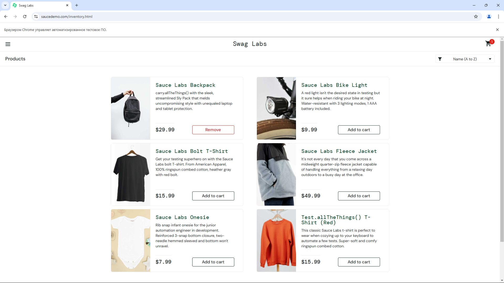
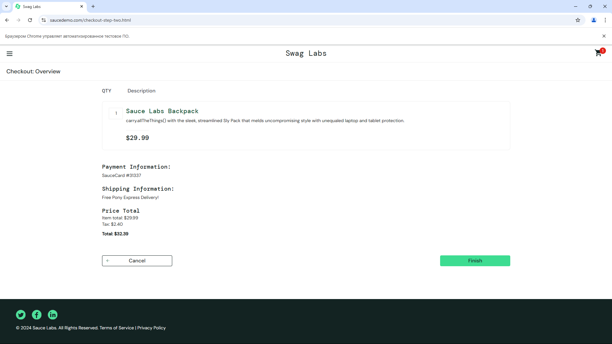
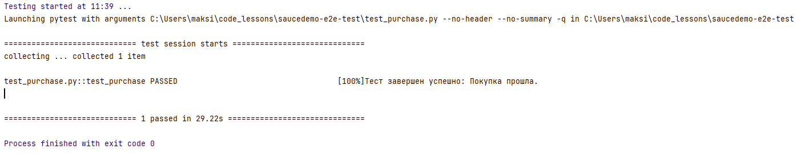

# Тестирование сценария покупки товара на сайте saucedemo.com

Этот тест проверяет покупку товара на сайте с авторизацией, выбором товара, его добавлением в корзину и завершением заказа.

Тест легко воспроизводим на любом компьютере, на котором установлен `Python` и `Selenium`.





### Структура проекта
```
saucedemo-e2e-test/
│
├── README.md                   # Инструкция по запуску проекта
├── requirements.txt            # Файл с зависимостями Python
├── test_purchase.py            # Основной файл с тестом
└── .gitignore                  # Файл для игнорирования лишних файлов в репозитории (например, виртуальное окружение)
```


### Описание структуры

- `README.md`: Файл с описанием проекта, требованиями и инструкцией по запуску тестов.
- `requirements.txt`: Список необходимых библиотек для работы теста.
- `test_purchase.py:` Сам тест на Python, использующий Selenium для автоматизации сценария покупки.
- `.gitignore:` Содержит правила для исключения файлов и папок из репозитория, например, venv/ для виртуального окружения и другие временные файлы.


### Установка

1. **Клонируйте репозиторий:**
   ```bash
   git clone <URL репозитория>
   cd <папка вашего проекта>
   ```

2. **Установите зависимости:**
   ```bash
   pip install -r requirements.txt
   ```

3. **Установите драйвер браузера для Chrome:**

   Установите [`ChromeDriver`](https://sites.google.com/chromium.org/driver/) или используйте `WebDriverManager`, который автоматически установит драйвер.


### Запуск теста

1. Запустите тест:
   ```bash
   python test_purchase.py
   ```

Тест автоматически выполнит сценарий от авторизации до завершения покупки и проверит успешное выполнение.


### Дополнительные библиотеки

**Если вы хотите автоматизировать управление драйвером, можно использовать библиотеку `WebDriverManager`:**

```bash
pip install webdriver-manager
```




**Автор:** © Дуплей Максим Игоревич

**Дата:** 12.09.2024

**Версия 1.0**